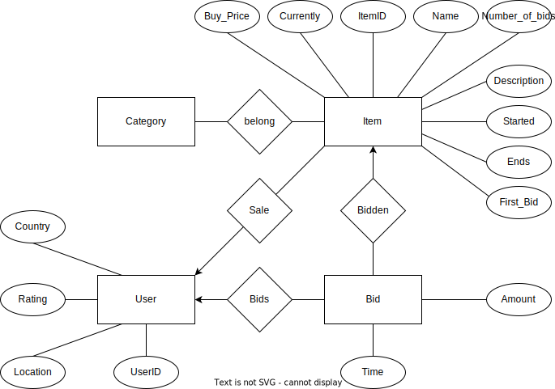

# CS 564 Homework 2 - ER Modeling & Schema Design

## ER diagram



## Relational schema definitions

```sql
CREATE TABLE User (
    UserID          VARCHAR(255)    PRIMARY KEY,
    Country         VARCHAR(255),
    Location        VARCHAR(255),
    Rating          INTEGER         NOT NULL
);
```

```sql
CREATE TABLE Item (
    ItemID          INTEGER         PRIMARY KEY,
    Name            VARCHAR(255)    NOT NULL,
    Description     VARCHAR(255)    NOT NULL,
    First_Bid       DOUBLE          NOT NULL,
    Buy_Price       DOUBLE
    Currently       DOUBLE          NOT NULL,
    Started         DATETIME        NOT NULL,
    Ends            DATETIME        NOT NULL,
    Number_of_bids  INTEGER         NOT NULL,
);
```

```sql
CREATE TABLE Bid (
    UserID      VARCHAR(255)        NOT NULL,
    ItemID      INTEGER             NOT NULL,
    Amount      VARCHAR(255)        NOT NULL,
    Time        DATETIME            NOT NULL,
    FOREIGN KEY (UserID) REFERENCES User (UserID),
    FOREIGN KEY (ItemID) REFERENCES Item (ItemID),
    PRIMARY KEY(UserID, ItemID, Time)
);
```
